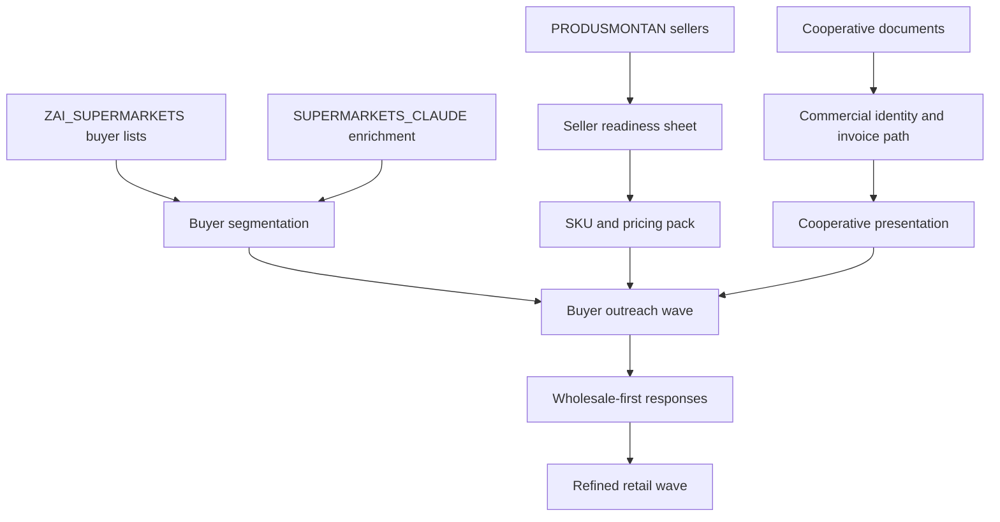

# Design: Launch Food Outreach Pipeline

## Overview

This change turns the FOOD workspace from a strategy archive into an execution-ready outreach system. The design is document-led rather than application-led: the key output is a controlled flow of seller readiness, buyer packaging, and wave-based outreach assets.

## Architecture Decisions

### Decision 1: Keep workspaces separate by role
- `PRODUSMONTAN` remains the supply and seller-source workspace.
- `COOPERATIVA BUSINESS` remains the legal and invoicing wrapper.
- `ZAI_SUPERMARKETS` remains the simple packaging and export layer for commercial lists.
- `SUPERMARKETS_CLAUDE` remains the enrichment and market-intelligence toolkit.

Rationale:
- The workspaces overlap in theme but not in operational purpose.
- Separating roles avoids accidental script convergence and preserves the fastest usable path for each kind of work.

### Decision 2: Treat seller readiness as the primary gate
- Buyer outreach quality depends on actual availability, pack sizes, and invoice readiness.
- The design therefore blocks outreach readiness until the seller sheet is operationally complete.

Rationale:
- The current bottleneck is not the lack of ideas or buyers; it is the conversion of seller-side material into a buyer-safe offer.

### Decision 3: Lead with wholesale-first outreach
- The first outreach sequence targets Metro, Selgros, and related wholesale routes before national-chain listing attempts.

Rationale:
- Wholesale channels are more forgiving operationally.
- They provide faster learning on assortment, pricing, and logistics.

## Artifact Flow

## Files In This Change

| File | Role |
|------|------|
| `openspec/changes/launch-food-outreach-pipeline/specs/outreach-pipeline/spec.md` | Defines the required behavior of the outreach workflow |
| `openspec/changes/launch-food-outreach-pipeline/tasks.md` | Breaks the change into executable work |
| `openspec/changes/launch-food-outreach-pipeline/assets/wholesale-first-outreach-email.md` | First buyer email template |
| `openspec/changes/launch-food-outreach-pipeline/assets/one-page-buyer-brief.md` | Buyer-facing one-page brief |

## Verification Strategy

- Verify the spec covers role ownership, seller-readiness gating, pack completeness, and wave sequencing.
- Verify tasks map directly to the spec requirements.
- Verify the initial outreach assets satisfy the pack requirement from the spec.
- Verify all change artifacts are synced to raspibig.